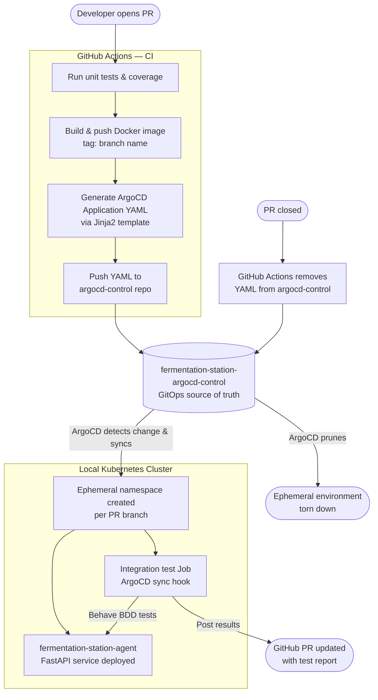

# Fermentation Station — Agent

The `fermentation-station-agent` is a FastAPI microservice designed to run on a node within a fermentation monitoring system. It exposes sensor data over HTTP and is built to be deployed and managed remotely via the [fermentation-station-argocd-control](https://github.com/lukasb27/fermentation-station-argocd-control) repo.

---

## System Architecture

This project is one of three repositories that together form the Fermentation Station platform:



On PR close, GitHub Actions automatically removes the ArgoCD Application YAML from the control repo, and ArgoCD prunes the ephemeral environment.

---

## Repositories

| Repo | Purpose |
|---|---|
| `fermentation-station-agent` (this repo) | FastAPI microservice, CI pipeline, Docker image |
| [`fermentation-station-argocd-control`](https://github.com/lukasb27/fermentation-station-argocd-control) | GitOps control repo — ArgoCD Application manifests |

---

## Tech Stack

| Layer | Technology |
|---|---|
| API | FastAPI + Uvicorn (Python 3.13) |
| Packaging | Poetry |
| Containerisation | Docker (multi-stage build) |
| Orchestration | Kubernetes + Kustomize |
| GitOps | ArgoCD |
| CI/CD | GitHub Actions |
| Unit Testing | Pytest + pytest-cov |
| Integration Testing | Behave (BDD, Gherkin) |
| Manifest Templating | Jinja2 |
| Code Quality | Black, isort, Flake8, mypy |

---

## Key Design Decisions

### Pluggable Sensor Abstraction
The agent uses an Abstract Base Class (`Sensor`) with two concrete implementations:
- `DevTempSensor` — returns stub data for local development and testing
- `TempSensor` — designed for real hardware integration

The correct implementation is injected at runtime via a dependency factory based on the `ENVIRONMENT` environment variable, making the service testable without physical hardware.

### Ephemeral Environments per PR
Every pull request automatically gets its own isolated Kubernetes namespace with a running instance of the agent. This is achieved by:
1. GitHub Actions generating a branch-specific ArgoCD Application YAML using a Jinja2 template
2. Pushing the YAML to the ArgoCD control repo
3. ArgoCD detecting the change and syncing the environment into the cluster

Environments are automatically torn down when the PR is closed.

### Integration Tests as ArgoCD Sync Hooks
Integration tests run as a Kubernetes `Job` triggered by an ArgoCD sync hook. This means tests run inside the cluster against the live deployed service, with results posted back to the PR via the GitHub API.

---

## Running Locally

### With Docker

```bash
# Development (with hot reload)
podman build --target development -t fermentation-station:dev .
podman run -d -p 8080:8000 -e ENVIRONMENT=dev fermentation-station:dev

# Production
podman build --target production -t fermentation-station:agent .
podman run -d -p 8080:8000 fermentation-station:agent
```

The API will be available at `http://localhost:8080`. FastAPI auto-generates interactive docs at `http://localhost:8080/docs`.

### Without Docker

```bash
# Install dependencies
poetry install

# Run the service
poetry run uvicorn fermentation_station.main:app --reload --port 8000
```

---

## Running Tests

```bash
# Unit tests with coverage
poetry run tox

# Or directly with pytest
poetry run pytest --cov=fermentation_station --cov-report=xml
```

---

## CI Pipeline

On every pull request, the pipeline:

1. Runs the full unit test suite via Tox
2. Posts a coverage report to the PR
3. Validates the PR title follows semantic commit conventions
4. Builds and pushes a branch-tagged Docker image to Docker Hub
5. Spins up an ephemeral Kubernetes environment via ArgoCD
6. Runs integration tests (Behave/BDD) inside the cluster as an ArgoCD sync hook
7. Posts integration test results back to the PR

On PR close, the ephemeral environment is automatically cleaned up.
